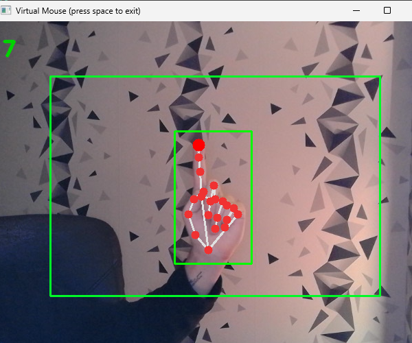

# Virtualis

It's an application allowing you to use a virtual mouse using your finger.

The app uses computer vision recognition AI to use a mouse, you can scroll, right click, left click and move the virtual mouse everywhere.

## Tech Stack

**AI Recognition:** mediapipe

**Drawing:** OpenCV

**Interface:** Tkinter


## Installation

The fastest way is to clone the repository and click on the **'start-app.bat'** and the application will **launch automatically**.

If you want to run the code from your code environment, do this :

=> You need to install **Python 3.11**

1-/ Clone this repository ```git clone https://github.com/nixiz0/DrawItium.git```

2-/ Create your environment ```python -m venv .env```

3-/ Download required libraries ```pip install -r requirements.txt```

4- Run the menu.py ```python menu.py```
## Feature Guide
**Camera Number :** You must enter the number of your camera you want to use, if you only have 1 camera then it will be 0, if you have 2 then it will be 1 etc

**Width & Height Camera :** You will also be asked for the detection width and height of your camera. For this you must click on the *"Cam Info"* button. Enter the number of the camera you want to use and you will have information on width and height that your camera uses.

**FPS :** If you put *"yes"*, it will display you at the top left the application's fps 

## Use the Virtual Mouse



**-Mouve the Mouse:** To move you just have to lift your **index finger** and it will automatically move your **mouse cursor** where you want

**-Left Click:** To left click you must have your **index finger raised** and you just have to **raise your middle finger** too

**-Right Click:** To right click you must have your **index finger raised** and you just have to **raise your little finger** too

**-Scroll Up:** To scroll up you just have to **touch your thumb with your index finger**

**-Scroll Down:** To scroll down, simply spread the **space between your thumb and index finger a little**

**-Stop Scroll** To stop scrolling you can put a **bigger gap between your thumb and index finger**, or you can **lower your thumb**
## Author

- [@nixiz0](https://github.com/nixiz0)

